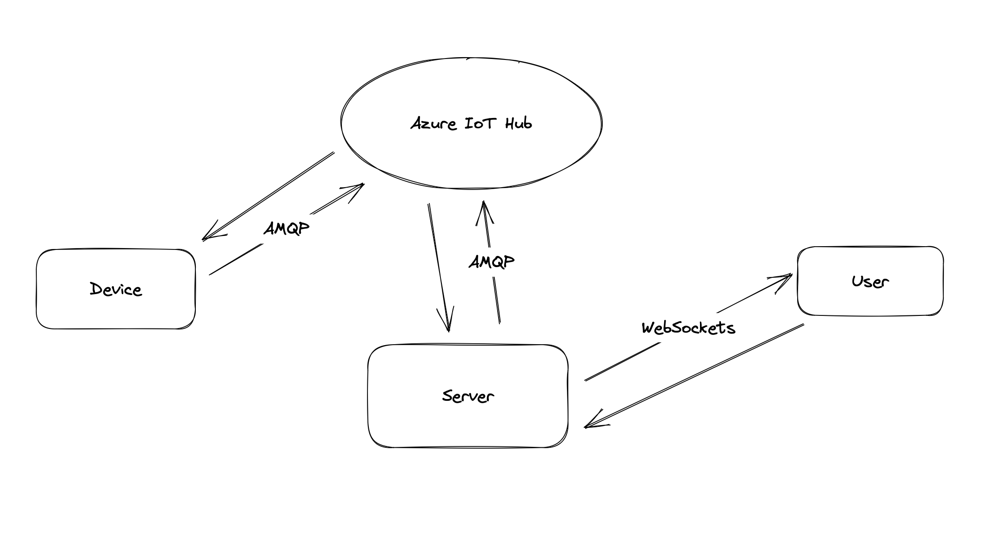

# Hands-on Lab Take Home

## How to run the app

The app was developed in python with flask. To run the app, follow the steps below.

1. Install all dependencies in the requirements.txt file. You can do this by running the command below in the terminal.

```pip3 install -r requirements.txt```

2. Install node modules neeeded for the frontend and generate tailwind classes.

```cd flaskr
npm install
npx tailwindcss -i ./static/src/input.css -o ./static/css/output.css
```

3. Create environment variables for the app. You can do this by creating .env file in the root directory of the app and adding the following variables.

```
CONNECTION_STRING=<your connection string for azure iothub device>
DEVICE_ID=<your device id>
IOTHUB_DEVICE_CONNECTION_STRING=<your connection string for device from azure iothub>
```

4. Run the mock device by running the command below in the terminal.

```python3 mock_device/main.py```

5. Run the app by running the command below in the terminal.

```python3 main.py```

## General approach to the challenge


I started by developing the login and registration page with flask, jinja2, tailwindcss, and sqlite. Then, I added real time communication between the server and the client with websockets. Then, I relayed the connection to the azure iothub, which communicated with the device over AMQP protocol.

## Biggest challenges

- Using Azure IoTHub: I had to read through quite a lot of documentation to get things set up right, which sometimes was also not correct due to deprecated examples and versions of the SDK. 
- Sending telemetry: I had to find how to get the telemetry data periodically from the device to the server. This took some time because I needed to run a separate thread for an infinite loop, which requested the data from the device.
  